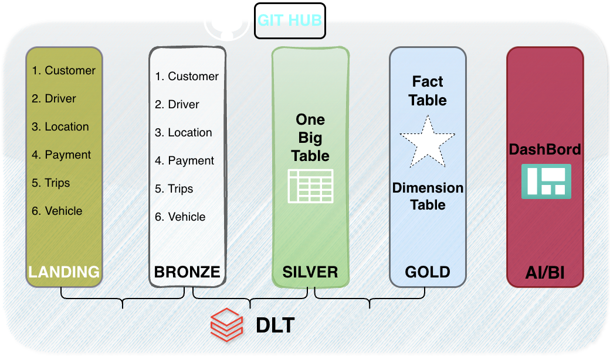
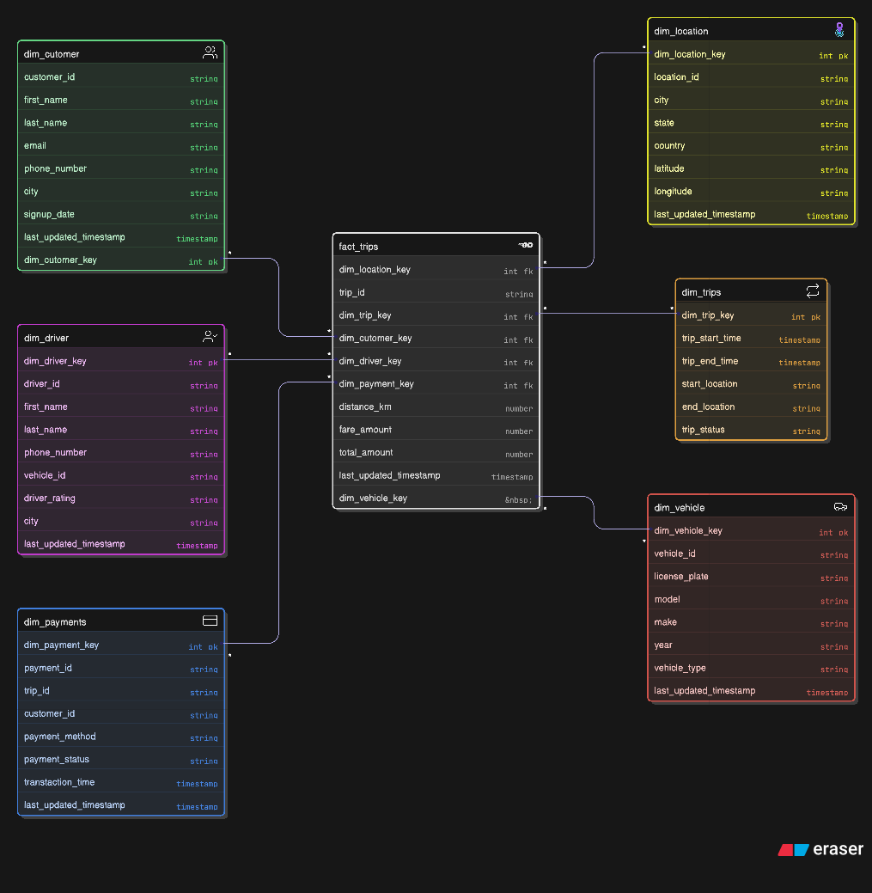

# Production-Ready Trips Data Pipeline using Databricks Delta Live Tables (DLT)

### 📌 Project Description

This project delivers a **production-grade data engineering solution** for a trips domain, leveraging **Databricks Delta Live Tables (DLT)** and the **Medallion Architecture** to transform raw, multi-source data into high-quality, analytics-ready datasets.

The pipeline supports **streaming and batch ingestion**, enforces data quality, and implements **Change Data Capture (SCD Type 1)** to maintain up-to-date dimensional data. It further structures the data into a **star schema (fact and dimension tables)**, enabling efficient querying and scalable analytical workloads.

---

### 🎯 Target Audience

* **Data Engineers** designing scalable, reliable data pipelines on Databricks
* **Analytics Engineers** implementing dimensional models and transformation layers
* **Data Analysts / BI Developers** requiring curated datasets for reporting and dashboards
* **Cloud & Data Platform Practitioners** exploring modern data architectures with Delta Lake and PySpark

## Architecture

## WhereHouse Model

## 🔗 Links

## 🛠 Skills
* **Data Engineering**

  * End-to-end pipeline design (ingestion → transformation → serving)
  * Batch and streaming data processing
  * Incremental data processing strategies

* **Databricks & Delta Live Tables (DLT)**

  * Building and orchestrating DLT pipelines
  * Implementing **Auto CDC (SCD Type 1)**
  * Managing pipeline dependencies and execution

* **PySpark**

  * Data transformation and optimization
  * Handling large-scale distributed datasets
  * Using built-in functions for cleansing and enrichment

* **Delta Lake**

  * ACID transactions and schema enforcement
  * Efficient storage with partitioning and optimization
  * Time travel and version control concepts

* **Data Modeling**

  * Designing **Medallion Architecture (Bronze, Silver, Gold)**
  * Building **Star Schema (Fact & Dimension tables)**
  * Surrogate key generation and relationship management

* **Data Cleaning & Quality**

  * Deduplication and standardization (email, phone, etc.)
  * Data validation using DLT expectations
  * Handling nulls and inconsistent formats

* **SQL**

  * Analytical query design
  * Aggregations and joins for reporting
  * Performance-aware query patterns

* **Streaming & Real-Time Processing**

  * Structured Streaming concepts
  * Continuous data ingestion and transformation

* **Cloud Data Platforms**

  * Working with cloud storage (DBFS / ADLS / S3)
  * Managing scalable data pipelines in distributed environments

* **Analytics & Reporting**

  * Preparing datasets for BI tools (Power BI, Tableau)
  * Building metrics such as revenue, trip counts, and performance KPIs

---

## Authors

- [@HRIDOY](https://github.com/hridoy1335)

## Contributing

⭐ Contribution

    1. Fork the repo
    2. Create feature branch
    3. Submit Pull Request

